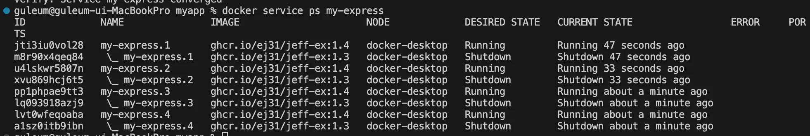

## 📆 2024-12-13

### 🔔 스크럼

- 학습 목표 1 : docker swarm실습 및 k8s
- 학습 목표 2 : 백준 16562번 친구비 문제풀이
   

### 🚀 Today I Learned

#### | docker swarm 실습 및 k8s

 

#### | [백준 16562번 친구비 문제풀이](https://github.com/availrum/newb/blob/main/friendspay.cpp)

### 🔥 오늘의 도전 과제와 해결 방법

- 도전 과제 1: docker swarm 및 k8s 개념정리
   

| 단어 | 정리 | 비고 |
| --- | --- | --- |
| ghcr | Github 컨테이너 레지스트리 서비스 |  |
| gh | 깃허브를 cli로 사용하기 위한 도구 > 자동화 가능 |  |
| 클러스터 | 비슷한 거 모아둔 그룹  | 노드들이 네트워크로 연결 → 노드 집합 == 클러스터 |
| 컴퓨터 클러스터 | 여러 컴퓨터가 한 컴퓨터로 동작하는 시스템 |  |
| 컨테이너 클러스터  | 여러 도커 호스트(노드??)를 하나의 통합된 가상 환경처럼 관리할 수 있게 하는 구조 |  |
| 노드 | 컴퓨터 클러스터에서 독립적으로 동작하는 하나의 컴퓨터 또는 서버 | - 노드는 클러스터 내 워크 로드 (== 작업) 실행 - 클러스터 크기와 요구사항에 따라 노드 수 조정 가능 |
| K8s | 컨테이너를 쉽고 빠르게 배포 및 확장하고 관리를 자동화해주는 서비스 구글에서 오픈소스로 제공하는 오케스트레이션 도구 | k(uber nete - 8글자)s  |
| Docker Swarm | docker에서 제공하는 오케스트레이션 도구 |  |
| 스케일링 | 서비스의 개수를 트래픽 양에 맞춰서 조정하는 기능 |  |
| 오케스트레이션 | 여러 시스템이나 서비스들을 알아서 잘 돌아가게 조정하고 관리하는 것 |  |

### 🗨️ 오늘의 회고

<!--
- 오늘의 학습 경험에 대한 자유로운 생각이나 느낀 점을 기록합니다.
- 성공적인 점, 개선해야 할 점, 새롭게 시도하고 싶은 방법 등을 포함할 수 있습니다.-->

다중 컨테이너의 레플리카를 만들어서 하는게 업무량 분할로 과부하를 막는 효과를 줄 수 있고
로드밸런싱 개념과 비슷하게 레플리카로 분배

 

### 📰 참고 자료 및 링크
